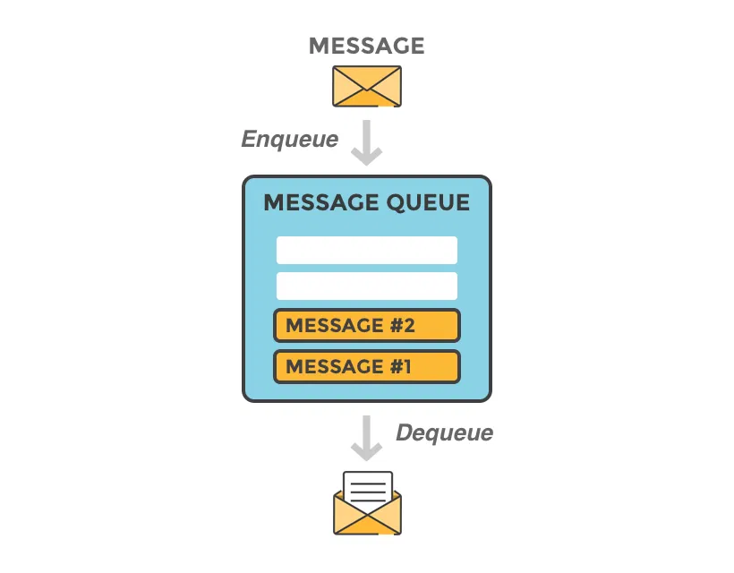
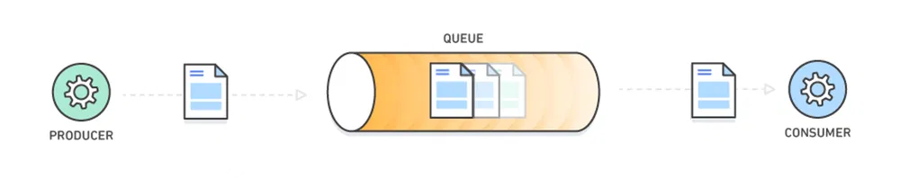

# Message Queue là gì? — Tổng quan theo 200Lab

## 1. Định nghĩa

**Message Queue** là một cơ chế trong lập trình và kiến trúc phần mềm, được sử dụng để truyền thông tin (thông điệp) giữa các thành phần của hệ thống mà **không cần chúng tương tác trực tiếp với nhau**.

Nói cách khác: Message Queue giúp các phần của hệ thống **giao tiếp bất đồng bộ**, thông qua một “hàng đợi trung gian” để đảm bảo tính linh hoạt, tách rời và dễ mở rộng.

---

## 2. Các thành phần chính trong Message Queue

Một hệ thống Message Queue thông thường bao gồm các thành phần:

- **Producer**: bộ phận tạo ra thông tin (message) và gửi vào Message Queue.
- **Consumer**: bộ phận nhận message từ Message Queue và xử lý.
- **Message**: thông tin thực tế được gửi — có thể dưới dạng text, JSON, hoặc binary.
- **Message Queue**: nơi lưu tạm các message cho tới khi consumer sẵn sàng xử lý.
- **Broker**: thành phần quản lý queue — định tuyến message, quản lý hàng đợi, đảm bảo message được truyền đúng cách giữa producer và consumer.
- **Channel** (nếu có): là kênh/đường truyền để producer gửi message vào queue và consumer lấy message ra.

---

## 3. Cách thức hoạt động

Quy trình hoạt động cơ bản của Message Queue như sau:

1. Producer tạo ra thông điệp (message), ví dụ dữ liệu dạng JSON.
2. Producer gửi message vào Message Queue thông qua channel. Message được lưu tạm tại queue.
3. Consumer kết nối tới queue, lấy message ra — thường theo cơ chế **FIFO** (First In First Out: vào trước, ra trước). Tuy nhiên có thể có cơ chế ưu tiên (priority) tuỳ hệ thống.
4. Consumer xử lý message theo logic nghiệp vụ của hệ thống.

Mô hình này giúp Producer và Consumer **không cần biết đến nhau** — họ chỉ cần tương tác qua broker/queue. Điều này làm giảm sự phụ thuộc chặt chẽ, tăng tính modular và dễ mở rộng.

## 4. Ưu điểm của Message Queue

Việc sử dụng Message Queue mang lại nhiều lợi ích, gồm:

1. **Bất đồng bộ**: Producer không phải đợi Consumer xử lý → cải thiện hiệu suất, giảm độ trễ cho người dùng.
2. **Tách rời (Decoupling)**: Producer và Consumer không cần biết về nhau — chỉ qua queue — giúp hệ thống linh hoạt, dễ mở rộng.
3. **Xử lý lưu lượng cao (High throughput / load handling)**: Có thể xử lý nhiều message từ nhiều nguồn đồng thời mà không ảnh hưởng lớn đến hiệu suất.
4. **Đảm bảo giao tiếp tin cậy (Reliability)**: Message được lưu tạm; nếu một phần hệ thống bị lỗi, message không bị mất mà chờ được xử lý.
5. **Giảm lỗi do phụ thuộc trực tiếp, dễ bảo trì**: Vì các thành phần hoạt động độc lập — nếu một service gặp lỗi, các service khác vẫn hoạt động bình thường.

---

## 5. Nhược điểm / Hạn chế của Message Queue

Tuy có nhiều lợi ích, Message Queue cũng có những điểm cần cân nhắc:

- **Phức tạp hóa hệ thống**: Đưa thêm queue, broker, channel… khiến kiến trúc phức tạp hơn, cần thêm effort quản lý.
- **Có thể có độ trễ (latency)**: Vì xử lý bất đồng bộ — message có thể phải chờ trong queue, không xử lý ngay lập tức.
- **Chi phí xử lý & quản lý**: Khi lượng message lớn, cần infrastructure mạnh, thiết kế queue/broker tốt — có thể đắt và khó quản lý.
- **Khó đảm bảo đồng bộ nếu cần**: Nếu hệ thống yêu cầu xử lý đồng bộ (real-time, ngay lập tức), queue bất đồng bộ có thể không phù hợp.

---

## 6. Ứng dụng thực tế của Message Queue

Message Queue được sử dụng rộng rãi đặc biệt trong các hệ thống lớn, phân tán hoặc dạng microservice. Một số ví dụ:

- **Xử lý đơn hàng & thanh toán trong hệ thống thương mại điện tử**: Khi người dùng đặt hàng, thông tin đơn hàng được đưa vào queue, hệ thống sẽ xử lý thanh toán, xác thực, cập nhật trạng thái — tách biệt đặt hàng và xử lý backend.
- **Xử lý sự kiện real-time / realtime event streaming**: Ví dụ trong hệ thống sensor, logging, analytics, dữ liệu từ nhiều nguồn sẽ gửi vào queue, consumer xử lý tuần tự hoặc song song.
- **Chia sẻ dữ liệu giữa nhiều ứng dụng / dịch vụ**: Các dịch vụ độc lập có thể trao đổi thông qua queue — giúp microservice dễ mở rộng, tách rời.
- **Xử lý các công việc nền (background jobs)**: Như gửi email, xử lý ảnh, xử lý dữ liệu, logging — producer gửi job vào queue, consumer xử lý sau — không block luồng chính.

Ngoài ra, trong thực tế có nhiều hệ thống MQ phổ biến như:

- RabbitMQ
- Kafka
- Amazon SQS
- MSMQ
- RocketMQ
- ZeroMQ

---

## 7. Kết luận

Message Queue đóng vai trò rất quan trọng trong các hệ thống phân tán, microservice — giúp:

- Cho phép giao tiếp bất đồng bộ giữa các thành phần.
- Giảm phụ thuộc trực tiếp giữa service, tăng tính modul, dễ bảo trì, dễ mở rộng.
- Xử lý tải cao, nhiều message, nhiều request đồng thời mà vẫn giữ ổn định.
- Đảm bảo tin cậy: message không bị mất khi service gặp lỗi, dễ phục hồi.

Tuy nhiên, khi hệ thống đơn giản hoặc không cần tính bất đồng bộ cao — việc thêm Message Queue có thể gây phức tạp không cần thiết. Việc chọn sử dụng MQ cần cân nhắc kỹ theo nhu cầu.
